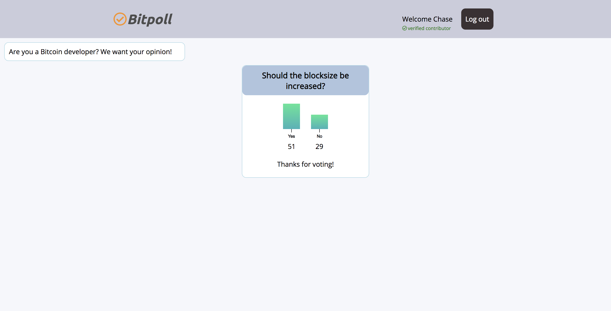

# Bitpoll

Bitpoll helps determine consensus within the Bitcoin development community by providing polls rescricted to developers of the Bitcoin project.

## Set Up

- Clone this project

- Run `npm install` from the root directory

- Run `npm start` and visit localhost:3000 in your browser

- Run tests with `npm test`
