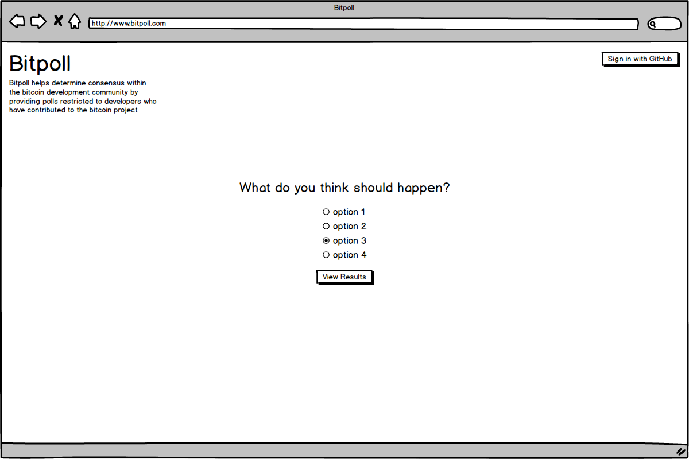

# Bitpoll

Bitpoll helps determine consensus within the Bitcoin development community by providing polls rescricted to developers of the Bitcoin project.

### Project team:

Chase Richard [GitHub](https://github.com/hmmChase)

### Original comp:

### Final design:

## Set Up

* Clone this project

* Run `npm install` from the root directory

* Run `npm start` and visit localhost:3000 in your browser

* Run tests with `npm test`
